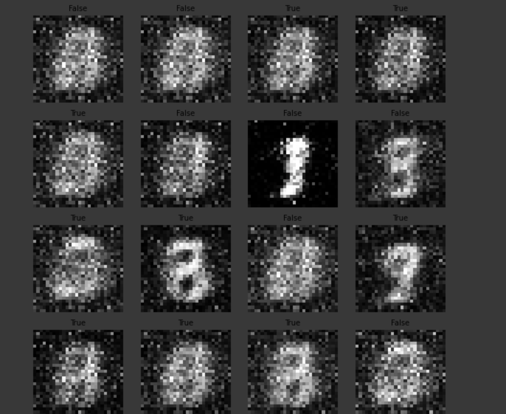
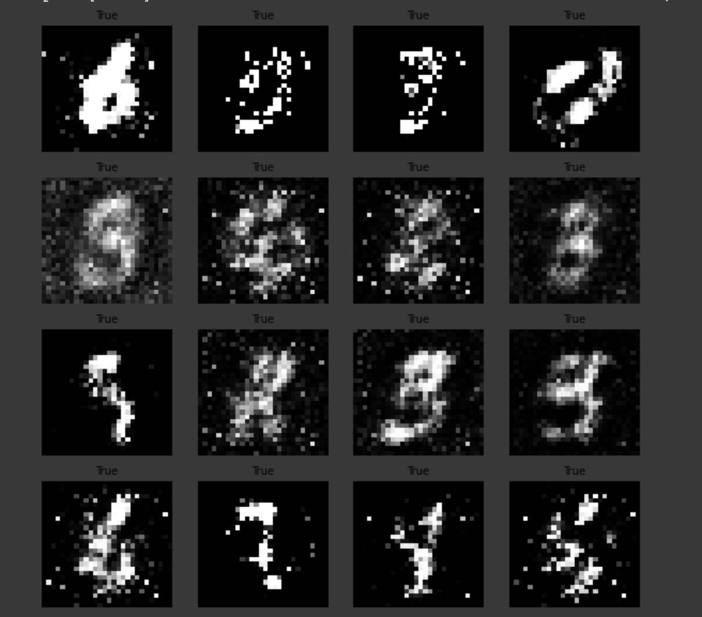

--- 
Period: 11.12.2020 - 14.12.2020
--- 
## Goals:
- [x] Conditional GAN testing
    - [x] improve the model for better performance
    - [x] add visual samples
- [ ] RNN G/D conditional timeGAN
    - [ ] custom dataset for stock data
        - [ ] basic testing
    - [ ] plotly
    - [ ] custom dataloader
        - [ ] complex testing
---
## Achievements:
1. Conditional GAN testing
    - @brief:
    - @result:
        - result for 0.5 dropout on D [ digit 0 - 100 epochs ]
             
        - result for 0.7 dropout on D and 10 training steps for G [ digit 0 - 50 epochs]
            Takes too long and G does not improve over time.
        - result for 0.5 dropout, BCELoss, Discriminator fl Sigmoid and min for G loss [ digit 0 - 50 epochs]
            
    - @docs:
        - [Improved Techniques for Training GANs](https://arxiv.org/pdf/1606.03498.pdf)
2. RNN G/D conditional timeGAN
    - @brief: 
    - @result:
    - @docs:
---
Problems:
1. problem number one

---
